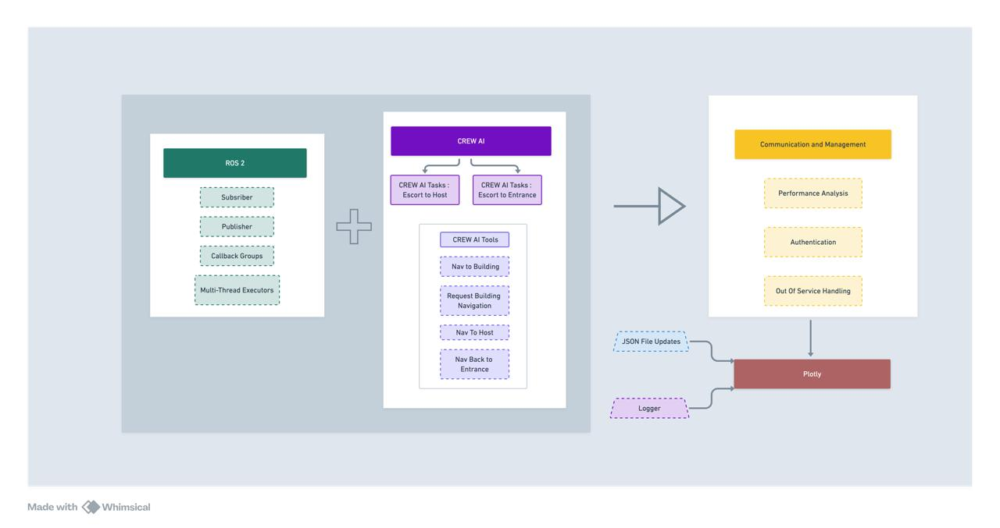
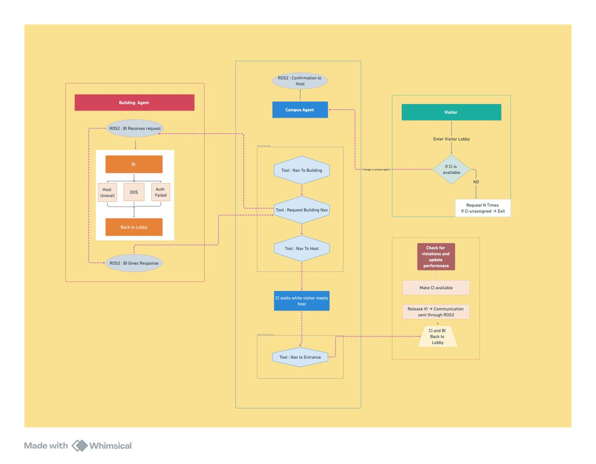

# Multi-Agent System using ROS2 and CrewAI

## Contributors
- [Aditi Baheti](https://www.linkedin.com/in/aditi-baheti-1805a8178/)
- [Nachiketa Purohit](https://www.linkedin.com/in/nachiketa-purohit-2409551b1/)

## Project Overview

This project implements a sophisticated Multi-Agent System leveraging the power of ROS2 (Robot Operating System 2) and CrewAI. The system is designed to simulate a campus environment with multiple agents interacting in a coordinated manner.

### Key Components

- **ROS2**: Utilized for robust communication and authentication between different nodes in the system.
- **CrewAI**: Employed for creating and managing various Tools and Tasks within the multi-agent framework.

## Simulation Setup

Our simulation environment consists of:

- 3 Campus Incharge Agents
- 7 Visitor Agents
- 4 Building Incharge Agents

This setup allows for complex interactions and scenarios within the simulated campus environment.

## Installation and Setup

### Prerequisites

- Anaconda or Miniconda
- ROS2 (Robot Operating System 2)
- CrewAI

### Environment Setup

1. Clone the repository:
   ```
   git clone [repository_url]
   cd [repository_name]
   ```

2. Create and activate the Conda environment:
   ```
   conda env create -f environment.yml
   conda activate [environment_name]
   ```

### Building the Project

3. Build all packages:
   ```
   ./build.sh
   ```

4. Source the setup file:
   ```
   source install/setup.bash
   ```

## Running the Simulation

To launch the multi-agent simulation:

```
ros2 launch multi_agent_launch_package multi_agent_launch.py
```

## System Architecture



## Agent Interaction Flow



## Features

- Real-time communication between agents using ROS2
- Scalable architecture supporting multiple agent types
- Simulated campus environment for testing and analysis

## Acknowledgments

- ROS2 Community
- CrewAI developers
- All contributors to this project